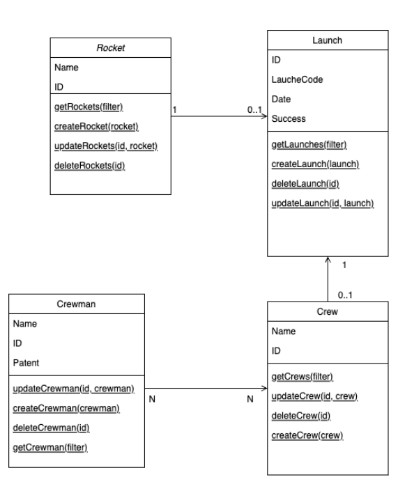

# 🚀 Rocket Launch System

    
    
    

---

Trabalho Prático da disciplina de de Engenharia de Software 2 da UFMG

## Grupo

- Gabriel Camatta Zanotelli - 2018020140
- Lucas de Almeida Martins - 2018020328
- Nander Santos do Carmo - 2018019931

## Explicação do sistema

Esse sistema simples simula uma aplicação responsável por catalogar lançamentos de foguetes. Cada um desses lançamentos sendo relacionados a um foguete único e podendo conter uma tripulação (lançamento tripulado). Essa tripulação por sua vez contém alguns triupulantes que possuem patentes ou "cargos". 

O sistema em si se trata de uma API REST simples, capaz de realizar todas as ações de CRUD (Create, Read, Update, Delete) para todas essas entidades descritas acima e representadas abaixo nesse diagrama relacional abaixo:

## Tecnologias utilizadas

Para o desenvolvimento desse sistema optou-se por utilizar as seguintes tecnologias:

- **Linguagem de Programação**: Typescript
- **Framework da API**: Express
- **Banco de dados**: PostgresSql

## Relatório inicial do Lizard

Do relatório de complexidade do sistema realizado pela ferramenta Lizard, pôde-se retirar que as três funções mais complexas do sistema são as seguintes:

| NLOC | CCN | token | PARAM | length | location                                     |
|------|-----|-------|-------|--------|----------------------------------------------|
|   20 |   9 |   140 |     1 |     26 | launchServiceCreateLaunch@22-47@src/service/LaunchService.ts |
|   20 |  10 |   216 |     2 |     27 | launchServiceUpdateLaunch@49-75@src/service/LaunchService.ts |
|   13 |   4 |   102 |     2 |     19 | crewServiceUpdateCrew@41-59@src/service/CrewService.ts |

### Análise de complexidade das funções:

| NLOC | CCN | token | PARAM | length | location |
|------|-----|-------|-------|--------|----------|
| 5    | 1   | 42    | 0     | 7      | (anonymous)@30-36@src/api.ts                     |
| 4    | 1   | 31    | 0     | 4      | (anonymous)@36-39@src/api.ts                     |
| 1    | 1   | 2     | 0     | 1      | (anonymous)@10-10@src/controller/CrewController.ts |
| 7    | 2   | 37    | 0     | 7      | getCrews@6-12@src/controller/CrewController.ts    |
| 1    | 1   | 2     | 0     | 1      | (anonymous)@18-18@src/controller/CrewController.ts|
| 7    | 2   | 45    | 0     | 7      | getCrew@14-20@src/controller/CrewController.ts     |
| 1    | 1   | 2     | 0     | 1      | (anonymous)@27-27@src/controller/CrewController.ts|
| 8    | 2   | 46    | 0     | 8      | createCrew@22-29@src/controller/CrewController.ts  |
| 1    | 1   | 2     | 0     | 1      | (anonymous)@36-36@src/controller/CrewController.ts|
| 8    | 2   | 55    | 0     | 8      | updateCrew@31-38@src/controller/CrewController.ts  |
| 1    | 1   | 2     | 0     | 1      | (anonymous)@44-44@src/controller/CrewController.ts|
| 7    | 2   | 45    | 0     | 7      | deleteCrew@40-46@src/controller/CrewController.ts  |
| 1    | 1   | 2     | 0     | 1      | (anonymous)@10-10@src/controller/CrewmanController.ts |
| 7    | 2   | 37    | 0     | 7      | getCrewmans@6-12@src/controller/CrewmanController.ts |
| 1    | 1   | 2     | 0     | 1      | (anonymous)@18-18@src/controller/CrewmanController.ts|
| 7    | 2   | 45    | 0     | 7      | getCrewman@14-20@src/controller/CrewmanController.ts |
| 1    | 1   | 2     | 0     | 1      | (anonymous)@27-27@src/controller/CrewmanController.ts|
| 8    | 2   | 46    | 0     | 8      | createCrewman@22-29@src/controller/CrewmanController.ts |
| 1    | 1   | 2     | 0     | 1      | (anonymous)@36-36@src/controller/CrewmanController.ts|
| 8    | 2   | 55    | 0     | 8      | updateCrewman@31-38@src/controller/CrewmanController.ts |
| 1    | 1   | 2     | 0     | 1      | (anonymous)@44-44@src/controller/CrewmanController.ts |
| 7    | 2   | 45    | 0     | 7      | deleteCrewman@40-46@src/controller/CrewmanController.ts |
| 1    | 1   | 2     | 0     | 1      | (anonymous)@10-10@src/controller/LaunchController.ts |
| 7    | 2   | 37    | 0     | 7      | getLaunchs@6-12@src/controller/LaunchController.ts |
| 1    | 1   | 2     | 0     | 1      | (anonymous)@18-18@src/controller/LaunchController.ts |
| 7    | 2   | 45    | 0     | 7      | getLaunch@14-20@src/controller/LaunchController.ts |
| 1    | 1   | 2     | 0     | 1      | (anonymous)@27-27@src/controller/LaunchController.ts |
| 8    | 2   | 46    | 0     | 8      | createLaunch@22-29@src/controller/LaunchController.ts |
| 1    | 1   | 2     | 0     | 1      | (anonymous)@36-36@src/controller/LaunchController.ts |
| 8    | 2   | 55    | 0     | 8      | updateLaunch@31-38@src/controller/LaunchController.ts |
| 1    | 1   | 2     | 0     | 1      | (anonymous)@44-44@src/controller/LaunchController.ts |
| 7    | 2   | 45    | 0     | 7      | deleteLaunch@40-46@src/controller/LaunchController.ts |
| 1    | 1   | 2     | 0     | 1      | (anonymous)@16-16@src/controller/RocketController.ts |
| 7    | 2   | 37    | 0     | 7      | getRockets@12-18@src/controller/RocketController.ts |
| 1    | 1   | 2     | 0     | 1      | (anonymous)@24-24@src/controller/RocketController.ts |
| 7    | 2   | 45    | 0     | 7      | getRocket@20-26@src/controller/RocketController.ts |
| 1    | 1   | 2     | 0     | 1      | (anonymous)@33-33@src/controller/RocketController.ts |
| 8    | 2   | 46    | 0     | 8      | createRocket@28-35@src/controller/RocketController.ts |
|     1 |   1 |     2 |     0 |      1 | (anonymous)@42-42@src/controller/RocketController.ts      |
|     8 |   2 |    55 |     0 |      8 | updateRocket@37-44@src/controller/RocketController.ts    |
|     1 |   1 |     2 |     0 |      1 | (anonymous)@50-50@src/controller/RocketController.ts      |
|     7 |   2 |    45 |     0 |      7 | deleteRocket@46-52@src/controller/RocketController.ts    |
|     7 |   3 |    37 |     0 |      7 | origin@6-12@src/middleware/config/CorsConfig.ts          |
|     1 |   2 |    42 |     1 |      1 | format@5-5@src/middleware/log/Logger.ts                 |
|     1 |   2 |    52 |     1 |      1 | format@10-10@src/middleware/log/Logger.ts                |
|     1 |   1 |    15 |     1 |      1 | format@18-18@src/middleware/log/Logger.ts                |
|     1 |   1 |    15 |     1 |      1 | format@22-22@src/middleware/log/Logger.ts                |
|     5 |   1 |    33 |      3 |      5 | constructor@15-19@src/model/Crewman.ts                   |
|     1 |   1 |      7 |     0 |      1 | ManyToMany@13-13@src/model/Crew.ts                        |
|     1 |   1 |      7 |     0 |      1 | OneToOne@20-20@src/model/Launch.ts                        |
|     1 |   1 |     11 |     0 |      1 | (anonymous)@24-24@src/model/Launch.ts                     |
|     7 |   1 |     24 |      3 |      7 | constructor@12-18@src/model/Rocket.ts                     |
|     3 |   1 |     19 |     0 |      3 | crewmanServiceGetCrewmans@7-9@src/service/CrewmanService.ts |
|     3 |   1 |     21 |     1 |      3 | crewmanServiceGetCrewman@11-13@src/service/CrewmanService.ts |
|     3 |   1 |     21 |     1 |      3 | crewmanServiceCreateCrewman@15-17@src/service/CrewmanService.ts |
| 6    | 1   | 54    | 2     | 8      | crewmanServiceUpdateCrewman@19-26@src/service/CrewmanService.ts |
| 3    | 1   | 20    | 1     | 3      | crewmanServiceDeleteCrewman@28-30@src/service/CrewmanService.ts |
| 4    | 1   | 24    | 0     | 4      | crewServiceGetCrews@11-14@src/service/CrewService.ts    |
| 5    | 2   | 37    | 1     | 7      | crewServiceGetCrew@16-22@src/service/CrewService.ts      |
| 2    | 2   | 4     | 0     | 2      | (anonymous)@27-28@src/service/CrewService.ts              |
| 1    | 1   | 6     | 0     | 1      | (anonymous)@28-28@src/service/CrewService.ts              |
| 1    | 3   | 19    | 0     | 1      | (anonymous)@30-30@src/service/CrewService.ts              |
| 12   | 3   | 75    | 1     | 16     | crewServiceCreateCrew@24-39@src/service/CrewService.ts     |
| 2    | 2   | 4     | 0     | 2      | (anonymous)@50-51@src/service/CrewService.ts              |
| 1    | 1   | 6     | 0     | 1      | (anonymous)@51-51@src/service/CrewService.ts              |
| 1    | 3   | 19    | 0     | 1      | (anonymous)@53-53@src/service/CrewService.ts              |
| 13   | 4   | 102   | 2     | 19     | crewServiceUpdateCrew@41-59@src/service/CrewService.ts    |
| 3    | 1   | 20    | 1     | 3      | crewServiceDeleteCrew@61-63@src/service/CrewService.ts    |
| 3    | 1   | 20    | 0     | 3      | launchServiceGetLaunchs@12-14@src/service/LaunchService.ts |
| 4    | 2   | 34    | 1     | 4      | launchServiceGetLaunch@17-20@src/service/LaunchService.ts  |
| 20   | 9   | 140   | 1     | 26     | launchServiceCreateLaunch@22-47@src/service/LaunchService.ts |
| 20   | 10  | 216   | 2     | 27     | launchServiceUpdateLaunch@49-75@src/service/LaunchService.ts |
| 3    | 1   | 20    | 1     | 3      | launchServiceDeleteLaunch@77-79@src/service/LaunchService.ts |
| 3    | 1   | 19    | 0     | 3      | rocketServiceGetRockets@9-11@src/service/RocketService.ts |
| 4    | 2   | 31    | 1     | 4      | rocketServiceGetRocket@13-16@src/service/RocketService.ts |
| 3    | 1   | 29    | 1     | 3      | rocketServiceCreateRocket@18-20@src/service/RocketService.ts |
| 5    | 1   | 46    | 2     | 7      | rocketServiceUpdateRocket@22-28@src/service/RocketService.ts |
| 3    | 1   | 20    | 1     | 3      | rocketServiceDeleteRocket@30-32@src/service/RocketService.ts |

### Análise de complexidade média das funções por arquivo:

| NLOC | Avg.NLOC | AvgCCN | Avg.token | function_cnt | file                                     |
|------|----------|--------|-----------|--------------|------------------------------------------|
| 30   | 4.5      | 1.0    | 36.5      | 2            | src/api.ts                               |
| 48   | 4.2      | 1.5    | 23.8      | 10           | src/controller/CrewController.ts         |
| 48   | 4.2      | 1.5    | 23.8      | 10           | src/controller/CrewmanController.ts      |
| 48   | 4.2      | 1.5    | 23.8      | 10           | src/controller/LaunchController.ts       |
| 54   | 4.2      | 1.5    | 23.8      | 10           | src/controller/RocketController.ts       |
| 18   | 0.0      | 0.0    | 0.0       | 0            | src/database/config/dataSourceConfig.ts  |
| 30   | 0.0      | 0.0    | 0.0       | 0            | src/database/migrations/1682003185225-create-entities.ts |
| 19   | 0.0      | 0.0    | 0.0       | 0            | src/dto/CrewDto.ts                       |
| 18   | 0.0      | 0.0    | 0.0       | 0            | src/dto/CrewmanCrewDto.ts                |
| 18   | 0.0      | 0.0    | 0.0       | 0            | src/dto/CrewmanDto.ts                    |
| 31   | 0.0      | 0.0    | 0.0       | 0            | src/dto/LaunchDto.ts                     |
| 15   | 0.0      | 0.0    | 0.0       | 0            | src/dto/RocketDto.ts                     |
| 16   | 7.0      | 3.0    | 37.0      | 1            | src/middleware/config/CorsConfig.ts      |
| 24   | 1.0      | 1.5    | 31.0      | 4            | src/middleware/log/Logger.ts             |
| 11   | 0.0      | 0.0    | 0.0       | 0            | src/middleware/router/CrewmanRouter.ts    |
| 11   | 0.0      | 0.0    | 0.0       | 0            | src/middleware/router/CrewRouter.ts       |
| 11   | 0.0      | 0.0    | 0.0       | 0            | src/middleware/router/LaunchRouter.ts     |
| 11   | 0.0      | 0.0    | 0.0       | 0            | src/middleware/router/RocketRouter.ts     |
| 18   | 5.0      | 1.0    | 33.0      | 1            | src/model/Crewman.ts                      |
| 24   | 1.0      | 1.0    | 7.0       | 1            | src/model/Crew.ts                         |
| 38   | 1.0      | 1.0    | 9.0       | 2            | src/model/Launch.ts                       |
| 18   | 7.0      | 1.0    | 24.0      | 1            | src/model/Rocket.ts                       |
| 38   | 0.0      | 0.0    | 0.0       | 0            | src/repository/CrewmanRepository.ts       |
| 33   | 0.0      | 0.0    | 0.0       | 0            | src/repository/CrewRepository.ts          |
| 28   | 0.0      | 0.0    | 0.0       | 0            | src/repository/LaunchRepository.ts        |
| 10   | 0.0      | 0.0    | 0.0       | 0            | src/repository/Repository.ts              |
| 37   | 0.0      | 0.0    | 0.0       | 0            | src/repository/RocketRepository.ts        |
| 29   | 3.6      | 1.0    | 27.0      | 5            | src/service/CrewmanService.ts             |
| 54   | 4.1      | 2.1    | 28.7      | 11           | src/service/CrewService.ts                |
| 66   | 10.0     | 4.6    | 86.0      | 5            | src/service/LaunchService.ts              |
| 30   | 3.6      | 1.2    | 29.0      | 5            | src/service/RocketService.ts              |

### Análise de complexidade média total do sistema

| Total nloc | Avg.NLOC | AvgCCN | Avg.token | Fun Cnt | Warning cnt | Fun Rt | nloc Rt |
|------------|----------|--------|-----------|---------|-------------|--------|---------|
|    884     |   4.3    |  1.7   |   29.4    |   78    |      0      |  0.00  |  0.00   |

